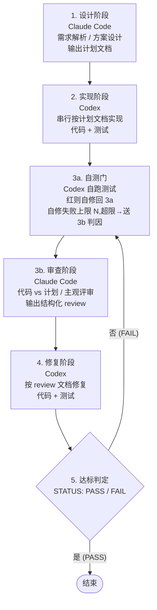

# 多智能体流水线式协作

日期: 2026-07-01
状态: 文档综述(基于 [dual-cli-pipeline 设计](./2026-06-30-dual-cli-pipeline-design.md) 与 [试跑计划](./2026-06-30-dual-cli-pipeline-trial-run-plan.md),整合 trial-001 / trial-002 试跑校验产出)
对应实现: `/wuhao/workspace/agent-pipeline/pipeline.py`(MVP)

## 1. 工具作用

**dual-cli-pipeline** 是一个半自动编排框架,驱动 **Claude Code CLI** 与 **Codex CLI** 两个智能体以流水线方式协作完成软件开发。

核心定位:
- **不是全自动**——关键决策(计划是否 OK、是否达标、停滞升级)由用户确认,脚本不替用户拍板。
- **不是单 agent**——两个 CLI 分工:Claude Code 当"大脑"(需求理解、方案设计、代码审查),Codex 当"手"(串行实现、按 review 修复、自测门内自修)。
- **不是 prompt 链**——阶段间靠**文档 artifact**(plan/review/fix)作为契约,而非上下文传递。每个 CLI 在自己阶段独立起会话,产物落盘,下一个 CLI 读盘续跑。

解决的实际问题:
1. 单 agent 干完整活容易"既当裁判又当运动员",审查时对自己代码宽容。
2. 纯自动 agent 链缺乏收敛监测,容易死循环或徒劳多轮。
3. 上下文窗口压力大——长会话跨阶段会丢上下文,文档契约避免这个问题。

## 2. 组成部分

### 2.1 流水线阶段



| 阶段 | 执行者 | 输入 | 输出 |
|------|--------|------|------|
| 1. 设计 | Claude Code | 设计文档(定位/模块拆分/技术选型) | `NNN-plan.md`(有序实现步骤,ground truth) |
| 2. 实现 | Codex | plan 文档 | 代码 + 测试 |
| 3a. 自测门 | Codex | 阶段2产出 | 自修日志;超限则卡点交棒 |
| 3b. 审查 | Claude Code | plan + 代码 + 上轮 fix(若有) | `NNN-review.md`(结构化,STATUS + ISSUE 清单) |
| 4. 修复 | Codex | plan + 上轮 review | 改后代码 + `NNN-fix.md` |
| 5. 达标判定 | 脚本 | review 的 STATUS 行 | 结束 / 回 3a |

### 2.2 关键工件(artifact)

每次循环产出文档,作为两个 CLI 间的契约:

```
agent-pipeline/
├── pipeline/
│   ├── artifacts/
│   │   ├── 001-plan.md       # 阶段1产出: 计划文档(ground truth, 后续只读基准)
│   │   ├── 002-review.md     # 阶段3b产出: 结构化 review(含收敛趋势)
│   │   ├── 003-fix.md        # 阶段4产出: 修复说明
│   │   ├── 004-review.md     # 第二轮 review
│   │   └── ...
│   ├── state.json            # 流水线状态(见 §3.3)
│   └── last-{claude,codex}.log  # 每次调用的完整 stdout/stderr
├── prompts/                  # 各阶段的 prompt 模板
│   ├── 01-design.md
│   ├── 02-impl.md
│   ├── 03-review.md
│   └── 04-fix.md
├── config.yaml               # pipeline 配置
└── pipeline.py               # 编排工具
```

### 2.3 编排工具(pipeline.py)

Python CLI 工具,职责:
1. 驱动阶段切换——调用对应 CLI,传入当前阶段 prompt + 上一阶段产出文档路径
2. 人工确认点——每阶段完成后暂停,打印「阶段 X 完成,产出在 <path>。回车继续 / e 编辑 / a 中止」
3. 状态持久化——`state.json` 记录状态,中断后 `--resume` 续跑
4. 达标判定——解析 review 的 `STATUS: PASS/FAIL` 决定终止或回 3a
5. 收敛监测——解析每轮 review 的 BLOCKER+MAJOR 数与类别,在停滞时升级处理

## 3. 细节实现

### 3.1 artifact 规范

#### plan 文档(001-plan.md)

后续所有阶段的只读基准,必须含**有序的实现步骤**:

```markdown
## 实现步骤

### 步骤 1: <目标简述>
- 目标: <这一步要达成什么>
- 涉及文件: <path1>, <path2>
- 自测验收点: <3a 自测门如何判断这一步完成;通常是某测试用例名或测试文件>
```

粒度约定:
- 每步能在一次 Codex 实现内完成,不跨多个不相关模块
- 步骤数 ≤ `max_iterations`(每轮 fix 至少能消化一个步骤级别的问题)
- 自测验收点必须可机器判定(测试名 / 测试文件 / 命令退出码),不写「代码看起来对了」
- **步骤是实现顺序指引,不是逐步验收边界**——3a 针对整个阶段 2 产出一起跑,不针对单步(步骤间常有依赖,如「步骤1写测试、步骤2实现函数」,逐步验收会卡死)
- **plan 内部一致性自检**:对同一输入,所有验收点的期望值不得互相矛盾。矛盾会导致 3a 出现「不可自修的红」,徒增一轮

#### review 文档(结构化)

```markdown
STATUS: PASS | FAIL

## 收敛趋势
- 本轮问题数(BLOCKER+MAJOR): <N>
- 上轮问题数(BLOCKER+MAJOR): <M 或 N/A>
- 趋势: 下降 | 持平 | 上升 | none(首轮无基线)

## 问题清单
### [BLOCKER-1] <问题标题>
- 类别: 测试失败 | 设计偏离计划 | 边界缺失 | 命名 | 安全 | 冗余 | 可读性 | 其他
- 位置: <file:line>
- 期望: <应是什么样的>
- 实际: <现在是什么样的>
- 根因: <代码bug | 计划矛盾 | 需求歧义 | 其他>  (3a卡点交棒时必填,正常review可选)

### [MAJOR-2] ...
### [MINOR-3] ...
```

字段约定:
- `STATUS`: PASS 表示达标可结束;FAIL 表示需进修复阶段
- **ISSUE id**:每个 ISSUE 必须有稳定 id(`BLOCKER-1` / `MAJOR-2` / `MINOR-3`,按 severity 内序号)。fix 用 id 引用,下一轮 review 用 id 关联「原 ISSUE 是否解决」+「是否同类重复」。脚本用 `### \[(BLOCKER|MAJOR|MINOR)-(\d+)\]` 正则解析
- severity 三档:BLOCKER(必须修才能过)、MAJOR(应修)、MINOR(可修可不修,pipeline 不计入收敛)
- **类别**:用于 §3.4「同类问题重复」判定,issue_history 须记录每轮的 categories 集合
- **根因字段**:3a 卡点交棒进 3b 时必填(判代码 bug / 计划矛盾 / 需求歧义);正常 review 可选。决定升级路径
- **收敛趋势**:首轮标 `none`(无基线,不触发停滞判定);后续轮由脚本对比 history 计算

#### fix 文档

```markdown
## 修复内容
### [BLOCKER-1→修] <处置>
- 改动: <file:line, 做了什么>
- 是否触及 plan 漂移: 是 | 否
- 若漂移: <说明改了 plan 范围内的什么代码产物,为何>

### [MAJOR-2→拒] <处置>
- 拒绝理由: <为什么不修>

## 自测结果
- pytest 输出 / 自修次数
```

要求:
- **逐条回应**:每个 BLOCKER/MAJOR 的 id 都要有一条 `[<id>→修|拒]`,不得偷懒只改一半
- **修复边界(R8)**:fix 允许改 plan 范围内的**代码产物**(测试断言、实现代码),但**禁止改 plan 的需求语义**(那是回阶段 1 的事)。即 fix 可改 `test_value_type` 的断言值,但不能改「值为整数转 int」这条需求本身
- **plan 漂移点标注(R9)**:fix 若改了 plan 范围内的代码产物,须显式标注「触及 plan 漂移: 是」并说明改了什么。下一轮 review 据此核查漂移是否合理

### 3.2 artifact 流向(契约方向)

```
001-plan ──(只读基准)──┐
                       ├──→ 3b review: 校验「代码 vs plan」一致性(含 plan 漂移核查)
                       └──→ 4 fix:    在 plan 范围内修复(允许改代码产物,禁止改需求语义)

002/004-review ──(工作指令)──→ 4 fix: 按 ISSUE id 清单逐条修

003-fix ──(变更说明)──→ 下一轮 3b review: 按 id 核查 ISSUE 是否真消除 + 有无新增 + plan 漂移是否合理
```

契约要点:
- plan → 后续:**只读基准**,但承认「plan 内部可能有错」。fix 不改 plan 文档本身;若 fix 改了 plan 范围内的代码产物(如测试断言),产生 **plan 漂移**,须在 fix 文档标注,review 核查合理性
- **plan 漂移的处理**:
  - 漂移落在「代码产物」(测试断言等)且修正了 plan 内部错误 → fix 可修,标注漂移,review 核查后接受。plan 文档可由用户在阶段 1 后手动同步(不在 fix 阶段自动改 plan)
  - 漂移触及「需求语义」→ fix 不得修,应触发 §3.4「回阶段 1 重设计」(说明计划本身有缺陷)
- review → fix:工作指令,fix 必须逐条回应每个 BLOCKER/MAJOR 的 id
- fix → review:变更说明,review 据此判断「问题是否真消除」+「有无新增问题」+「plan 漂移是否合理」

### 3.3 state.json 状态持久化

```json
{
  "stage": "3b-review",
  "iteration": 2,
  "plan_artifact": "artifacts/001-plan.md",
  "last_review": "artifacts/002-review.md",
  "open_issues": {"blocker": 1, "major": 2, "minor": 3},
  "issue_history": [
    {"iteration": 1, "blocker": 3, "major": 4, "minor": 1, "categories": ["测试失败", "设计偏离计划"]},
    {"iteration": 2, "blocker": 1, "major": 2, "minor": 3, "categories": ["设计偏离计划"]}
  ],
  "convergence_trend": "下降",
  "stall_flags": {"same_category_repeat": 0, "issue_count_not_decreasing": false},
  "selftest_stall": {"occurred": false, "iteration": null, "auto_fix_attempts": 0, "codex_report": null}
}
```

字段说明:
- `stage`: 当前阶段(`1-design` / `2-impl` / `3a-selftest` / `3b-review` / `4-fix` / `done`)
- `iteration`: 第几轮 review-fix 循环(从 1 起)
- `open_issues`: 当前轮 review 的剩余问题数(按 severity)
- `issue_history`: 每轮的问题数快照 + categories 集合,用于判断收敛趋势与同类重复
- `convergence_trend`: `none`(首轮无基线)/ 下降 / 持平 / 上升,由脚本对比 history 计算。首轮为 `none`,不触发停滞判定
- `stall_flags`: 停滞标记,触发升级处理(§3.4)
- `selftest_stall`: 3a 自修失败记录。`occurred` 是否发生、`iteration` 哪轮、`auto_fix_attempts` 自修次数、`codex_report` Codex 的卡点说明(为何不可自修)。发生时 3a 直接送 3b,review 须读此字段判根因

### 3.4 收敛监测与升级处理

`max_iterations` 是硬上限,但在到达上限前应主动识别停滞并升级:

| 停滞信号 | 触发条件 | 升级动作 |
|---------|---------|---------|
| 同类问题重复 | 连续 2 轮 review 出现同 `类别` 的 BLOCKER | 回阶段 1 重设计(说明计划本身有缺陷) |
| 问题数不降 | 本轮 BLOCKER+MAJOR 数 ≥ 上轮(且非首轮,且非 3a 卡点交棒轮) | 暂停,人工介入决定是否调整范围 |
| 3a 自修失败(R7) | 3a 自修达 `selftest_max_fixes` 次仍红 | 送 3b 判根因;若 review 判为「计划矛盾」直接回阶段 1 |
| 硬上限 | `iteration > max_iterations` | 强制停,人工介入 |

升级动作统一走「人工确认点」:脚本暂停并打印停滞原因 + 建议动作,由用户决定回阶段 1 / 继续硬撑 / 中止。

注:
- 「问题数不降」判定须排除「3a 卡点交棒轮」——该轮红是设计问题非实现问题,问题数对比无意义
- 「同类问题重复」按 issue_history 的 categories 集合交集判断

### 3.5 阶段 3a 自测门

实现完先自己跑测试,红了读测试输出自修、再跑,直到全绿。

**收益定位(R2)**:核心是**拦住崩代码**(语法错/导入错/跑不过的代码)不进 3b,避免浪费 Claude Code review 预算——而非「补 Codex 的漏实现」(靠漏实现触发 3a 不可靠,Codex 常一次写对)。

**自修失败上限(R7)**:设 `selftest_max_fixes=N`(默认 3)。Codex 自修 N 次仍红,标记 `selftest_stall`,**直接送 3b 让 Claude Code 判根因**——因为不可自修的红通常是设计层问题(需求矛盾/计划错误),不是代码 bug,Codex 在 3a 阶段死循环无意义。Codex 须在自测日志中报告:每次红在哪、自修了几次、为何判定不可自修。

**为什么拆 3a/3b**:测试失败(确定性)与 review 不通过(主观)修复路径不同,混在一起会让 Claude Code 浪费预算在明显崩的代码上。

> MVP 当前关闭 3a(`self_test_gate: false`),退化为直接进 3b。配置字段保留为后续开接口。

### 3.6 CLI 调用细节

**Claude Code**(`run_claude`):
```bash
claude -p --output-format text --permission-mode acceptEdits
```
- `-p`: 非交互模式,prompt 经 stdin 传入
- `--permission-mode acceptEdits`: 让 claude 能写 artifact 文件(默认 -p 模式无写权限)

**Codex**(`run_codex`):
```bash
codex exec --sandbox workspace-write --skip-git-repo-check -C <project_root>
```
- `exec`: 非交互执行
- `--sandbox workspace-write`: 允许写工作目录
- `--skip-git-repo-check`: 允许在非 git 仓库目录下写代码(项目可能尚未 git init)
- `-C`: 指定工作目录

两次调用都有 30 分钟超时,超时也会落日志保留 partial 输出便于诊断。完整 stdout/stderr 落到 `pipeline/last-{label}.log`。

**observe_mode(观察模式)**: 由 `config.yaml` 的 `observe_mode` 字段切换,控制 agent 输出的观察与中途干预方式。
- `plain`(默认,向后兼容):pipeline 直接 spawn agent,前台流式输出 `stdout/stderr`(边跑边 tee 到 `pipeline/last-{label}.log`),无 tmux 依赖。前台按 `q` 键向 agent 发 SIGINT 中止当前阶段
- `tmux`:在独立 tmux session(`pipe-{label}`)里跑 agent,用户 `tmux attach -t pipe-{label}` 实时观察,可在 pane 内 Ctrl-C 中止;pipeline 主进程轮询退出码文件 + session 存活,流式日志靠 `tmux pipe-pane` 落盘。tmux 缺失时不自动降级,直接报错

两种模式下,中止最终都让 agent 收到 SIGINT、退出码非零,走现有 `choice="a"` 中止路径,state 留在当前阶段,可 `--resume` 续跑。CLI 调用层的实现架构(调用栈、plain/tmux 双路 runner、InterruptHub、shell 注入安全、防静默零产出)见 [pipeline.py 实现架构分析](./docs/2026-07-02-pipeline-implementation-architecture.md)。详见 [设计文档](./docs/superpowers/specs/2026-07-01-tmux-observability-design.md)。

### 3.7 prompt 模板渲染

`prompts/` 下每个阶段一个模板,用 `{{key}}` 简单替换:

```python
def render_prompt(cfg, template_name, **kwargs):
    tpl = (cfg["_prompts_dir"] / template_name).read_text()
    for k, v in kwargs.items():
        tpl = tpl.replace("{{" + k + "}}", str(v))
    leftover = re.findall(r"\{\{[^}]+\}\}", tpl)
    if leftover:
        print(f"[warn] prompt 模板 {template_name} 有未替换占位符: {leftover}", file=sys.stderr)
    return tpl
```

模板里占位符如 `{{plan_artifact_name}}`、`{{artifacts_dir}}`、`{{prev_blocker_major}}` 等,由阶段函数从 state + cfg 计算。

## 4. 使用方式

### 4.1 安装与配置

1. 确保已安装 Claude Code CLI(`claude`)和 Codex CLI(`codex`)并配置好认证
2. 复制 `config.example.yaml` 为 `config.yaml`,按需修改:

```yaml
project:
  name: <你的项目名>
  root: <项目根目录绝对路径>

clis:
  claude:
    cmd: "claude"
  codex:
    cmd: "codex"

# 相对 project.root
artifacts_dir: pipeline/artifacts
state_file: pipeline/state.json

max_iterations: 5
pass_marker: "STATUS: PASS"

# observe_mode: agent 输出的观察模式 (plain 默认 / tmux 独立 session 可 attach + Ctrl-C)
observe_mode: plain

# 阶段 3a 自测门(MVP 关)
self_test_gate: false
selftest_max_fixes: 3

# 收敛监测(MVP 关;字段保留为后续开接口)
stall_detection:
  same_category_repeat: 2
  issue_count_not_decreasing: false
```

3. 准备一份**设计文档**(架构/定位/模块拆分级),作为阶段 1 的输入。注意:不接收零散需求文本,设计文档要给出需求定位、模块拆分、技术选型,Claude Code 只做"转译成有序实现步骤"

### 4.2 启动流水线

```bash
# 新跑(必须提供 --design-doc)
python pipeline.py config.yaml --design-doc path/to/design.md

# 续跑(从 state.json 恢复)
python pipeline.py config.yaml --resume

# 只打印不执行 CLI(调试用)
python pipeline.py config.yaml --design-doc path/to/design.md --dry-run
```

环境变量:
- `PIPELINE_AUTO_CONFIRM`: 设为首字符(c/e/a 之一),跳过人工确认点(用于自动化测试)

### 4.3 人工确认点

需要用户介入的点:
- **阶段 1 后**:计划文档是否值得让 Codex 实现(步骤是否可执行、自测验收点是否可判定、需求与验收点是否语义一致)。可选 `c`(继续进阶段 2)/`e`(中止让我编辑 plan)/`a`(中止)
- **阶段 3a 卡点时(R7)**:Codex 自修失败交棒,review 判根因后,人工确认下一步(回阶段 1 修 plan / 继续 fix)
- **阶段 3b 后每轮**:review 是否通过(再修一轮 / 够了 / 回阶段 1 重设计)。可选 `c`(进阶段 4 fix)/`a`(中止)
- **收敛停滞时(§3.4)**:同类问题重复或问题数不降,人工决定下一步
- **兜底**:达到 `max_iterations` 强制停,人工介入

其余(3a 自测门内 Codex 自修在限额内、调 Codex 实现、跑测试、读 review 文档、解析收敛趋势)脚本自动做。

### 4.4 编辑 plan 后续跑

阶段 1 完成选 `e` 时,脚本暂停并提示「请手动编辑 plan 后, 用 --resume 继续」。这是用户干预 plan 内容的官方路径——plan 是 ground truth,但人工判断可推翻。编辑后用 `--resume` 从阶段 2 继续。

## 5. 注意事项

### 5.1 plan 内部一致性(试跑教训)

plan 的「需求」与「自测验收点」必须语义一致——不能需求说 A、验收点断言非 A。设计阶段须自检:对同一输入,所有验收点的期望值不得互相矛盾。

trial-002 埋了「需求说『值为整数转 int』,但步骤 3 `test_value_type` 断言 `{"a": "1"}`(字符串)」的矛盾坑,Codex 必然踩一个 test,fix 改一边必踩另一边,徒劳多轮。这类矛盾应在阶段 1 自检排除。

### 5.2 步骤间依赖

实现步骤是给 Codex 的**实现顺序指引**,不是逐步验收边界。自测验收点针对**整个阶段 2 产出**(全部步骤完成后一起跑 3a),不针对单步。理由:步骤间常有依赖(如「步骤 1 写测试、步骤 2 实现函数」,步骤 1 单独跑必红),逐步验收会卡死。脚本化时阶段 2 作为整体跑完再进 3a。

### 5.3 自修次数自报不可核实

fix 文档的自测结果里 Codex 自报「自修次数」,仅作参考,脚本无法核实。trial-001 Codex 自报「自修次数: 0」(首轮即绿),脚本无独立渠道验证。设计上接受这个限制——3a 自修次数只用于诊断,不用于达标判定。

### 5.4 埋坑触发 3a 不可靠

不要靠「故意在 plan 里漏边界用例」来验证 3a——Codex 常一次写对,3a 不红。trial-001 埋的「空串」坑被 Codex 一次性处理了。要真正验证 3a,需在 plan 里写自相矛盾的需求(如 trial-002 坑 2)或语法错。3a 的真正价值是**拦崩代码**(语法错/导入错/跑不过),不是拦漏实现。

### 5.5 utils 子模块依赖规则

若被开发项目(如 hos-manager)有 `utils/` 公共子模块:
- ❌ 禁止在 `utils/` 下的代码中 import 具体项目路径(如 `taskmanager/xxx`)
- ❌ 禁止在 `utils/` 中依赖 `internal/` 包的代码
- ✅ 可以引用第三方库(如 `github.com/redis/go-redis/v9`)
- ✅ 可以引用 Go 标准库

原因:`utils/` 是通用工具库,必须保持项目无关性,才能在多个项目间复用。这条约束应在 plan 文档里显式写出,Codex 实现时遵守。

### 5.6 已知盲区(MVP 未实现)

| 盲区 | 说明 | 补跑方式 |
|------|------|---------|
| 3a 自测门 | MVP 关闭(`self_test_gate: false`) | 第二里程碑开 |
| 收敛停滞真实触发 | T3/T4 未实测(Codex 太会修,构造不出停滞) | trial-003 构造「fix 改不动」场景 |
| 达标柔性出口(R5) | STATUS=PASS 时用户可选继续打磨 | 第一版可不实现,默认 PASS 即结束 |
| 全自动无人介入 | 设计明确不包含 | 不在路线内 |

## 6. 扩展路线

### 6.1 第二里程碑(近期)

1. **开 3a 自测门**:实现 `self_test_gate: true` 路径,Codex 实现完先自跑测试,红了自修,达 `selftest_max_fixes` 仍红送 3b 判根因。需在 `pipeline.py` 加 `stage_selftest` 函数、`state.json` 加 `selftest_stall` 字段、`prompts/` 加 `03a-selftest.md` 模板
2. **开收敛监测**:实现 `stall_detection` 的两条触发路径(同类问题重复 / 问题数不降),升级动作走人工确认点
3. **达标的柔性出口(R5)**:STATUS=PASS 时允许用户选「再 review 一轮」(不消耗 `max_iterations` 配额)。适用场景:代码已达标,但用户想再让 Claude Code 找找潜在改进点(MINOR 级)
4. **结合 tmux 等终端多路复用工具,实现 agent 任务执行实时可观测性**(已实现,见 [设计文档](./docs/superpowers/specs/2026-07-01-tmux-observability-design.md)):CLI 调用从 `subprocess.run(capture_output=True)` 阻塞捕获改为按 `observe_mode` 分发到 `tmux` / `plain` 两套 runner。`plain`(默认)直接 spawn agent 前台流式输出 + tee 落日志;`tmux` 在独立 `pipe-{label}` session 里跑 agent,`tmux attach` 实时观察,pane 内 Ctrl-C 或前台 q 键中止。两种模式中止都收敛为非零退出码走现有 `choice="a"` 路径,state 留当前阶段可 `--resume`。收益:长阶段(尤其阶段 2 实现、3a 自修)不再黑盒,卡点时能立刻定位是 agent 卡住还是真在思考;也便于中途判断是否该 Ctrl-C 中止重来
5. **记录 pipeline 运行期间 agent 使用的 token 总量与 API 请求次数,按阶段记录并支持汇总**:当前 `pipeline/last-{label}.log` 只存 stdout/stderr 文本,没有结构化的成本数据。可让 claude/codex 启动时开启 usage 输出(`claude --output-format json` 含 `usage` 字段、codex 的 `--json` 事件流含 usage 事件),pipeline 解析后按「阶段 × 轮次 × agent」维度入库。收益:能横向对比 Claude Code vs Codex 的单轮成本、纵向看哪一轮 fix 最烧 token、估算一个完整流水线的真实开销,为「max_iterations 是否该调高」「3a 自测门省不省 review 预算」等决策提供数据。汇总输出可加 `pipeline cost` 子命令,打印每阶段 token/请求次数表 + 总计,可选 `--csv` 导出便于长期追踪

### 6.2 后续打磨

1. **plan 漂移自动同步**:当前 fix 改了 plan 范围内的代码产物后,plan 文档本身需用户手动同步。可加一个 `pipeline sync-plan` 子命令,读 fix 文档的「触及 plan 漂移: 是」条目,生成 plan 更新建议供用户审核
2. **ISSUE 跨轮关联自动化**:当前 review 的「原 ISSUE 是否解决」靠 Claude Code 自觉写。可在 review 模板里加「原 ISSUE 状态表」字段,脚本解析后给下一轮 review 做对照
3. **多项目并行**:当前一个 config 一个项目。可加 `pipeline run-all <config-dir>` 批量驱动多个项目的流水线
4. **Web UI 观察台**:把 `state.json` + `issue_history` 渲染成时序图,直观看到收敛趋势与停滞点
5. **阶段 2/4 分步驱动 codex 避免单次上下文爆掉**(已实现):`stage_impl` 改为按 plan 的「### 步骤 N」分多次调 codex,每次只传当前步骤的 prompt(含步骤标题 + body + 工作目录),不再一次性塞 plan 全文 + 设计文档。配合 `02-impl.md` 模板明确禁止 codex 主动 `cat`/`sed` 读其他文件,prompt 里已贴它需要的全部片段。收益:单次 codex 调用窗口占用从 30 万 token 降到 1-2 千字符级,杜绝「上下文耗尽 → 静默零产出 → review 死循环」(配合 `stage_impl`/`stage_fix` 的 mtime sanity check 拦截)。`stage_fix` 暂沿用一次性调用(fix 阶段单轮改动量小,爆窗口风险低,后续视情况扩展)

### 6.3 不在路线内(明确排除)

- **并行 subagent**:设计明确串行,不并行。理由:串行按 plan 步骤实现,plan 文档需明确「有序的实现步骤」而非「可并行的独立任务块」。并行会引入 subagent 间状态共享与冲突,复杂度收益不划算
- **全自动无人介入**:半自动是核心定位,关键决策(计划是否 OK、是否达标、停滞升级)由用户确认。全自动会让流水线在计划缺陷时死循环或产出错误代码

## 7. 开发

### 7.1 跑测试

```bash
pip install -r requirements-dev.txt   # 含 pytest
pytest tests/                          # 跑全部测试
pytest tests/test_pipeline.py -k tmux_session   # 只跑某单元
```

测试用 mock 覆盖 `tmux_session` 生命周期、`run_plain` 流式/中断/超时、`InterruptHub` tty 跳过/tmux C-c/plain event、`run_in_tmux_pane` heredoc 拒绝/pane 死推断 130/exit_path 正常读/超时 124、`_run_cli` 分发/默认 plain/dry-run 跳过/异常清理/tmux 缺失/日志写失败降级。真实 tmux + claude/codex 的端到端行为靠手工验收,清单见 [设计文档 §7.4](./docs/superpowers/specs/2026-07-01-tmux-observability-design.md)。

### 7.2 手工验收清单(真实环境)

1. `observe_mode: plain` 跑 `--dry-run` → 行为与改造前一致
2. `observe_mode: plain` 真跑 codex → 前台看到流式输出,日志落全,退出码正确
3. `observe_mode: tmux` 真跑 codex → `tmux ls` 看到 `pipe-codex`,attach 后看到 agent 输出
4. tmux 模式下 agent pane 按 Ctrl-C → pipeline 报 `[error] codex 退出码 130, 中止`,state 留在 `2-impl`
5. tmux 模式下 pipeline 前台按 q → 同上效果
6. tmux 模式下 agent 正常完成 → session 自动 kill,无残留
7. `observe_mode: tmux` 但无 tmux → 报错提示安装,不崩
8. 超时(把 timeout 改成 5s 跑 codex)→ 报 `[error] codex 超时`,session 被清理

## 8. 相关文档

- [dual-cli-pipeline 设计](./docs/2026-06-30-dual-cli-pipeline-design.md) — 完整设计 v2(经试跑校验,trial-001 / trial-002 已跑通,修订项 R1-R9 已并入)
- [dual-cli-pipeline 试跑计划](./docs/2026-06-30-dual-cli-pipeline-trial-run-plan.md) — 手动跑通实施计划,沉淀文档模板并反哺设计
- [pipeline.py 实现架构分析](./docs/2026-07-02-pipeline-implementation-architecture.md) — 实际代码结构、调用栈、plain/tmux 双路 runner、InterruptHub、shell 注入安全、防静默零产出
- `runs/trial-001/`、`runs/trial-002/` — 试跑记录(含 friction-log 与 artifact 实例)
- `pipeline.py` — MVP 编排工具实现
- `prompts/` — 各阶段 prompt 模板(01-design / 02-impl / 03-review / 04-fix)
- `config.example.yaml` — 配置样例
